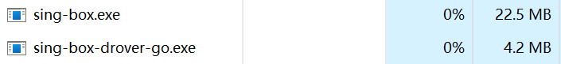
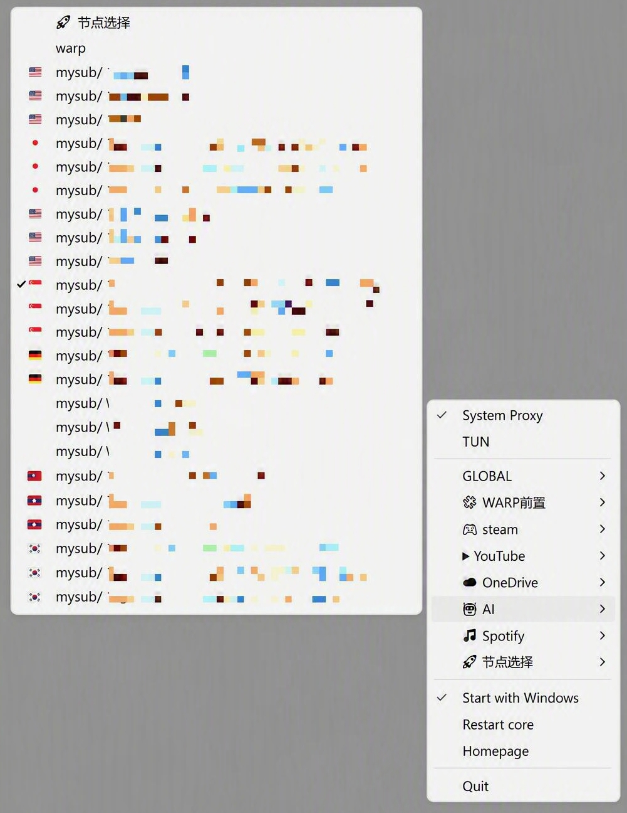

# sing-box-drover-go（Go 重构版）

本项目是 [`hdrover/sing-box-drover`](https://github.com/hdrover/sing-box-drover) 的 Go/Win32 重构版。它保留了原项目使用外置 sing-box.exe 内核，通过 Windows 托盘控制系统代理、TUN 和出站选择器”的核心定位，并针对 reF1nd 等兼容内核的 provider 节点展开方式进行了适配。

## 重构原因

- [`hdrover/sing-box-drover`](https://github.com/hdrover/sing-box-drover)不适配 [`reF1nd`](https://github.com/reF1nd/sing-box) 内核 `config.json` 的
  `provider` 写法，托盘菜单节点显示不全。
- [`hdrover/sing-box-drover`](https://github.com/hdrover/sing-box-drover)用 `Pascal` 语言编写，编译环境过大，难以维护。

## 内存占用

托盘控制器通常约 4–8 MiB（Windows 任务管理器的工作集，不包含 sing-box
内核；实际值会随系统和配置变化）。这个结果基于 Go 1.25.6 的 Windows amd64
构建。

## 菜单界面

## 文档

- 用户使用、配置和首次测试见 [使用说明](docs/usage_note.md)；
- 目录、构建和自动发布见 [开发说明](docs/dev_note.md)。
