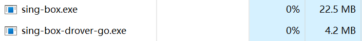
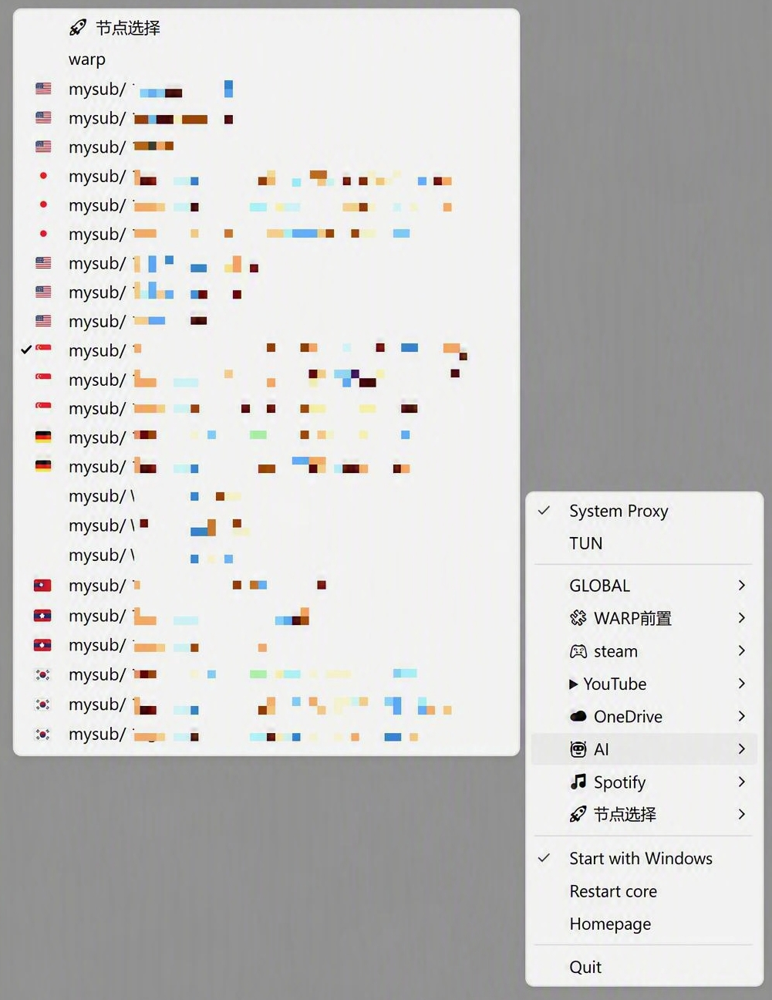

# sing-box-drover-go（Go 重构版）

本项目是 [`hdrover/sing-box-drover`](https://github.com/hdrover/sing-box-drover) 的 Go 重构版。Windows 使用原生 Win32 托盘，macOS 使用 AppKit 状态栏；两端都通过外置 sing-box 内核控制系统代理、TUN 和出站选择器，并针对 reF1nd 等兼容内核的 provider 节点展开方式进行了适配。

## 重构原因

- [`hdrover/sing-box-drover`](https://github.com/hdrover/sing-box-drover) 不适配 [`reF1nd`](https://github.com/reF1nd/sing-box) 内核 `config.json` 的
  `provider` 写法，托盘菜单节点显示不全。
- [`hdrover/sing-box-drover`](https://github.com/hdrover/sing-box-drover)用 `Pascal` 语言编写，编译环境过大，难以维护。

## 平台支持

- Windows 10/11 amd64：原生 Win32 托盘、WinINet 系统代理、任务计划程序登录启动和 UAC 提权。
- macOS 12+ universal：原生 AppKit 状态栏、`networksetup` 系统代理、LaunchAgent 登录启动和按需管理员提权；发布包同时包含 arm64 与 x86_64。
- 两端都要求用户自行提供对应平台的 `sing-box`/`sing-box.exe` 和真实配置，不内置代理内核。

## 内存占用

历史样本曾约 4–8 MiB（Windows 任务管理器的工作集，不包含 sing-box
内核；实际值会随系统和配置变化）。这个数字来自 Go 1.25.6 的旧 Windows amd64
构建，仅供参考，不是当前版本的性能承诺；Go 1.25.14 正式构建仍需在相同条件下
复测 Working Set 和 Private Memory 后再更新结论。

## 菜单界面

## 文档

- 用户使用、配置和首次测试见 [使用说明](docs/usage_note.md)；
- 目录、构建和自动发布见 [开发说明](docs/dev_note.md)。
